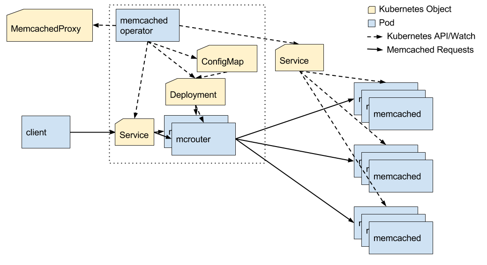

# Memcached Operator Design

This document describes the architecture & design of the memcached operator.

[//]: # (TODO: Update design doc)

## Overview

Kubernetes provides a built in mechanism for service discovery and rudamentary load balancing using [Services](https://kubernetes.io/docs/concepts/services-networking/service/). Unfortunately this is not ideal for services such as memcached. A typical memcached cluster shardes cache data among servers and uses consistent hashing of the cache key determine the server to connect to. Kubernetes operates on TCP/UDP connections and does not have this level of knowledge of the memcached protocol.

Users can solve this issue with client side load balancing but it requires a method of updating the list when memcached cluster instances are added or deleted. This requires application level support or a sidecar container. Configuration is more complex and backend cache servers may be overloaded with connections.

The memcached operator allows users to access a cluster via a single Kubernetes `Service` endpoint that supports sharding memcached keys using a proxy server.

The memcached operator introduces a `MemcachedProxy` [custom resource definition](https://kubernetes.io/docs/tasks/access-kubernetes-api/extend-api-custom-resource-definitions/) (CRD) which is used to describe a proxy to a set of memcached instances. The memcached operator watches `MemcachedProxy` objects for additions/changes/deletions. For each `MemcachedProxy` a deployment is created to manage the proxy itself. A configmap and service for the proxy are also created and managed by the memcached operator. Users connect to the proxy via this service endpoint.

If a user scales the memcached cluster by changing the number of pods, the memcached operator will update the memcached proxy configuration and cause it to be reloaded by each proxy instance.

The memcached operator will use [mcrouter](https://github.com/facebook/mcrouter) as the memcached proxy.



## MemcachedProxy CRD

The `MemcachedProxy` CRD has the following structure. This describes the custom resource that can be created via the Kubernetes API.

apiVersion: apiextensions.k8s.io/v1beta1
kind: CustomResourceDefinition
metadata:
  # name must match the spec fields below, and be in the form: <plural>.<group>
  name: memcachedproxies.v1alpha1.ianlewis.org
spec:
  # group name to use for REST API: /apis/<group>/<version>
  group: v1alpha1.ianlewis.org
  # version name to use for REST API: /apis/<group>/<version>
  version: v1
  # either Namespaced or Cluster
  scope: Namespaced
  names:
    # plural name to be used in the URL: /apis/<group>/<version>/<plural>
    plural: memcachedproxies
    # singular name to be used as an alias on the CLI and for display
    singular: memcachedproxy
    # kind is normally the CamelCased singular type. Your resource manifests use this.
    kind: MemcachedProxy
    # shortNames allow shorter string to match your resource on the CLI
    shortNames:
    - mp

An instance of the `MemcachedProxy` custom resource looks like this.

```
apiVersion: ianlewis.org/v1alpha1
kind: MemcachedProxy
  name: example-cluster
spec:
  serviceName: memcached-pool1
  servicePort: 11211
```

Each proxy object specifies a service name. This service is used to get the list of pods that are members of the memcached cluster. For instance, users could create their memcached cluster using the [memcached helm chart](https://github.com/kubernetes/charts/tree/master/stable/memcached) which creates a [headless service](https://kubernetes.io/docs/concepts/services-networking/service/#headless-services) for the cluster. The user would then specify the name of that service in their `MemcachedProxy` resource. Using services gives users flexibility in how they deploy their memcached cluster. For instance, users could create a headless service without a selector which maps to memcached instances running outside the cluster as well.

## Scaling Memcached Clusters

When the pods for the memcached cluster are added or deleted, the memcached operator generates a new [mcrouter configuration file](https://github.com/facebook/mcrouter/wiki/Config-Files) and updates a configmap that holds the configuration. When a configmap is updated Kubernetes updates the relavent files mounted in each container. Mcrouter watches changes to the config file and will reload it automatically.

## Future considerations

Future versions of the memcached operator should be able to support different configurations of memcached clusters. Particularly, support for replication rather than sharding, and combination of sharding and replication.
